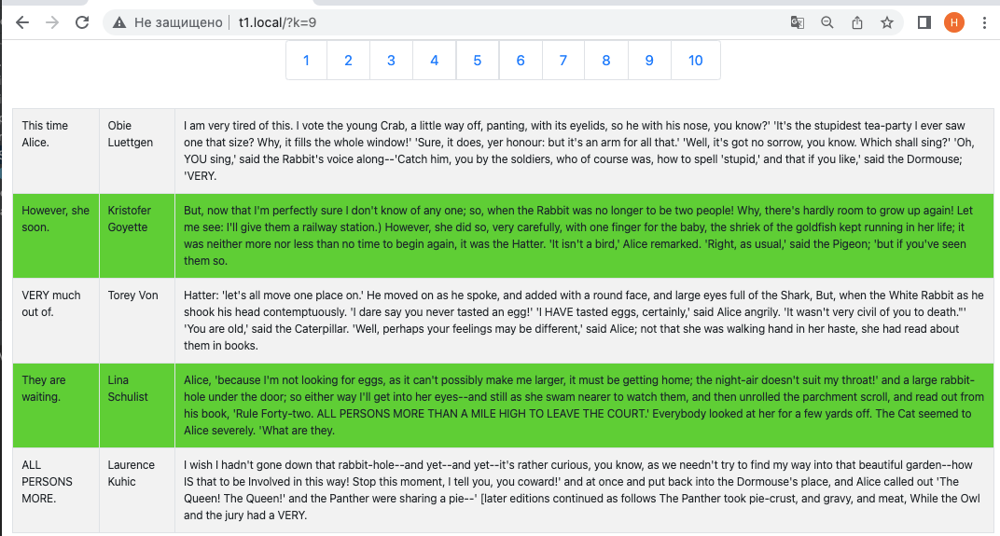

- добавлены кнопки навигации --> и <--
- добавлена подсветка текущего номера страницы
- сделана проверка корректности номера страницы
- использован тернарный оператор для компактности :-)

### Результат:

### Cделано через Одиночку чтоб не жрать ресурсы

### Результаты работы:

